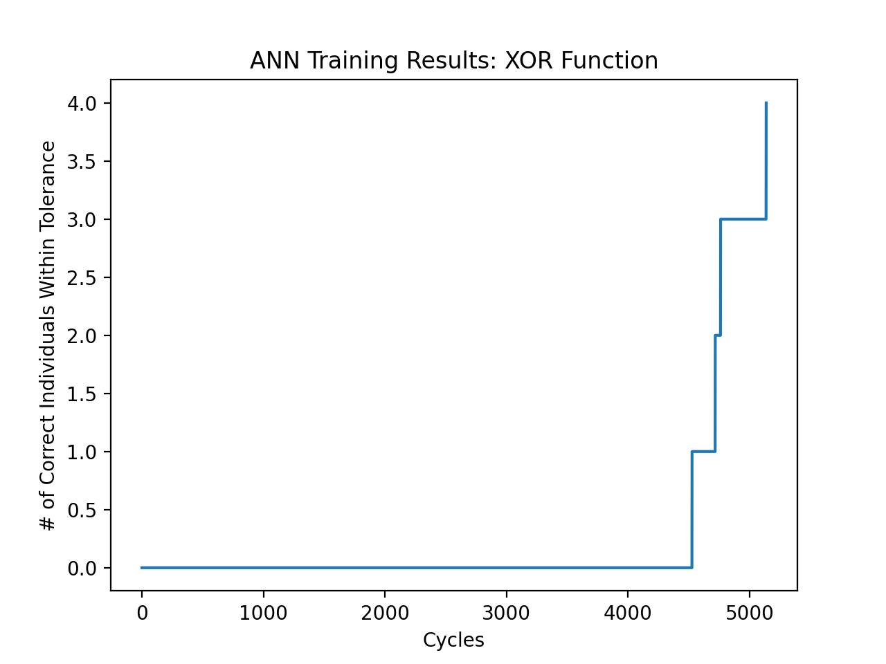
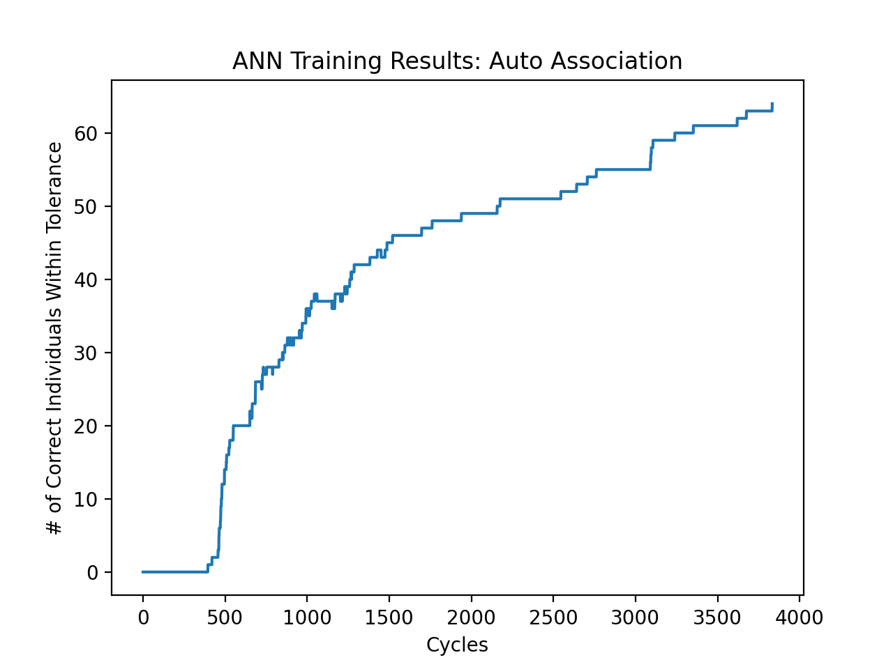

# Analysis

Detailed above is a quantitative analysis of the ANN for the XOR and Auto Association data sets. The XOR neural network has two input nodes and one output node. The Auto Association neural network had eight input nodes and eight output nodes. Both networks had a single hidden layer with three nodes. The Auto Association network has more incremental increases than the XOR network due to the fact that it is a larger network with more targets (64 vs 4). Specific details of how the networks forward propagates, backward propagates, and computes error can be found in the comments of "backprop.py" 
